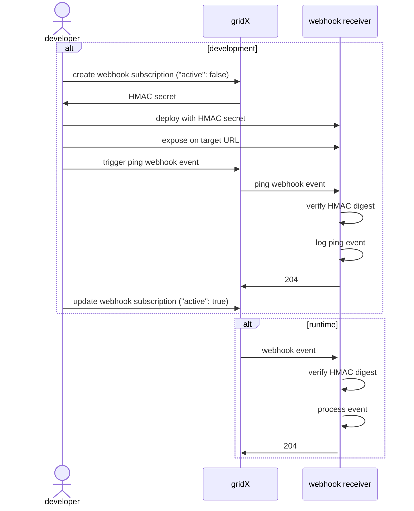

# :spider_web: :hook: Integrating systems with the gridX webhook subscription API

The webhook subscription API lets XENON users manage webhook subscriptions for an account.

## Migration from Notification Rule API

> [!WARNING]
> 
> **Managing webhook subscriptions through the [Notification Rule API](
> https://community.developer.gridx.de/t/gridx-api-documentation/213#post-/accounts/-accountID-/users/-userID-/notifications/rules)
> won't be supported anymore as of 21.08.2025.**
> 
> **The new [Webhook Subscription API](
> https://community.developer.gridx.de/t/gridx-api-documentation/213#get-/accounts/-accountID-/webhooks) should be 
> used to manage webhook subscriptions from then on.**  
> 
> We will automatically migrate all existing webhook settings on notification rules to webhook subscriptions during this 
> [maintenance window (21.08.2025 18:00-21:00)](
> https://support.gridx.de/hc/de/articles/28369740677266--Wartungsfenster-am-Donnerstag-21-August-von-18-00-bis-21-00-Uhr-MEZ).
>
> For that, we will merge webhook settings with the same `accountID`, `targetURL` and `secret` into a single webhook 
> subscription, as we now support subscribing to multiple event types at once.
> 
> Because webhook subscriptions are now account-scoped, you will find webhook subscriptions migrated from any user's 
> notification rules in your account on the [`GET /accounts/{accountID}/webhooks` endpoint](
> https://community.developer.gridx.de/t/gridx-api-documentation/213#get-/accounts/-accountID-/webhooks) from then on.
> 
> **All changes affect only management of webhook subscriptions. No changes will affect or break the actual webhook
> receiver implementation.**

The following table provide an overview of the changes migrating from the deprecated Notification Rule API to the new
Webhook Subscription API.

From 21.08.2025 on:

| Notification Rule API (deprecated)                                     | Webhook Subscription API                                                    |
|------------------------------------------------------------------------|-----------------------------------------------------------------------------|
| User-scoped: `/accounts/{acountID}/users/{userID}/notifications/rules` | Account-scoped: `/accounts/{accountID}/webhooks`                            |
| Required policies: `AccountsUsersRead` and `AccountsUsersWrite`        | Required policies: `WebhooksRead` and `WebhooksWrite`                       |
| Subscribes to one `eventType`.                                         | Subscribes to one or many `eventTypes`                                      |
| Clients can upload their own HMAC secrets (without validation)         | Generates cryptographically strong HMAC secrets                             |
| Signs requests only with one HMAC secret                               | Signs requests temporarily with multiple secrets for zero-downtime rotation |
| -                                                                      | Supports sending `ping` events for integration testing                      |
| -                                                                      | Property `active` can be used to pause a webhook subscription               |
| -                                                                      | Improved performance due to decoupling from user notifications processing   |

Planned future improvements - timeline will be announced on the [developer community](
https://community.developer.gridx.de/tag/webhooks):
- We will offer subscribing to e-mail notifications for `webhook/failed` and `webhook/deactivated` events in your XENON
  account via the XENON dashboard.
- We will automatically deactivate a webhook subscription after 10 consecutive failures.
- We will offer querying failed invocation logs.

Finally, find a comparison between the deprecated notification rule representation and the new webhook subscription 
representation.

<details>

<summary>Notification Rule (deprecated)</summary>

**POST `/accounts/{acountID}/users/{userID}/notifications/rules`**

Request:
```json
{
  "eventType": "appliance/online",
  "notificationType": {
    "webhook": {
      "targetURL": "https://example.com/hooks/xenon",
      "secret": "whsec_89d31d45a90e309f4e24b7..."
    }
  },
  "locale": "DE"
}
```

Response:
```json
{
  "id": "49a4f165-8233-426b-a1a4-e569665a25dd",
  "accountID": "49a4f165-8233-426b-a1a4-e569665a25dd",
  "userID": "49a4f165-8233-426b-a1a4-e569665a25dd",
  "eventType": "appliance/online",
  "notificationType": {
    "webhook": {
      "targetURL": "https://example.com/hooks/xenon",
      "secret": "whsec_89d31d45a90e309f4e24b7..."
    }
  },
  "locale": "DE"
}
```

</details>

<details>

<summary>Webhook susbcription</summary>

**POST `/accounts/{acountID}/webhooks`**

Request:
```json
{
  "eventTypes": [
    "appliance/online",
    "appliance/offline"
  ],
  "targetURL": "https://example.com/hooks/xenon",
  "active": false
}
```

Response:
```json
{
  "id": "49a4f165-8233-426b-a1a4-e569665a25dd",
  "accountID": "49a4f165-8233-426b-a1a4-e569665a25dd",
  "eventTypes": [
    "appliance/online",
    "appliance/offline"
  ],
  "targetURL": "https://example.com/hooks/xenon",
  "active": false,
  "secret": "whsec_89d31d45a90e309f4e24b7..."
}
```

</details>

The rest of this documentation will focus on how to implement and register webhook receivers on the Webhook Subscription
API.

## Overview

The gridX webhook API lets you manage webhook subscriptions for an account on the gridX webhook API. A webhook 
subscription subscribes to one or many event types in the referenced gridX account. If an event occurs with a type 
matching any webhook subscription in that account, then this event will be sent to each matching webhook subscription's 
target URL through an HTTP POST request. The web server listening on that target URL is called a webhook receiver.

With this, webhook subscriptions are a powerful tool to build system integrations on top of XENON, that can react 
programmatically to events.

Webhook subscriptions are always scoped to an account. It is not supported to subscribe to events in multiple accounts
at once. For that, you need to create a webhook subscription on the according event types in each account.

In order to be allowed to manage webhook subscriptions, clients must have the policies `WebhooksRead` and
`WebhooksWrite` in the account, they want to manage webhook subscriptions for.

This guide walks through implementing a webhook receiver to react on events in a gridX account and registering it on
the gridX webhook API.

This sequence diagram outlines the process of building and integrating a webhook receiver with the gridX webhook API:


## Supported event types

We support the following event types on a webhook subscription:
- `appliance/create`: A new appliance has been created.
- `appliance/delete`: An appliance has been deleted.
- `appliance/offline`: An appliance's state switched offline. 
- `appliance/online`: An appliance's state switched online.
- `appliance/upate`: An appliance has been update.
- `ev/charge-started`: Charging has started for an electric vehicle.
- `ev/charge-stopped`: Charging has stopped for an electric vehicle.
- `ev/control` (**deprecated**)
- `ev/create`: A new electric vehicle has been created. (**deprecated**)
- `ev/delete`: An electric vehicle has been deleted. (**deprecated**)
- `ev/measurement`
- `ev/plugged`: An electric vehicle has been plugged into a charging station. 
- `ev/unplugged`: An electric vehicle has been plugged out of a charging station.
- `ev/update`: An electric vehicle has been updated. (**deprecated**)
- `gateway/create`: A new gateway has been created. 
- `gateway/offline`: A gateway's state switched offline. 
- `gateway/online`: A gateway's state switched online. 
- `grid-signal-processor/limitation-of-power-consumption/set`: The grid signal processor has set a new limitation of 
   power consumption.
- `grid-signal-processor/limitation-of-power-consumption/unset`: The grid signal processor has unset a limitation of
   power consumption.
- `inverter/status`: The status of an inverter has changed.
- `system/action`

## Handling webhook event requests

Events are sent via HTTP requests to webhook receivers.

> [!IMPORTANT]
> 
> For receiving and processing webhook events successfully, make sure that your webhook receiver 
> implementation fulfills these criteria:
> - **The registered target URL starts with the `https` scheme and is secured by a trusted TLS certificate.**
>   - Self-signed certificates are not supported.
> - **The webhook receiver accepts `POST` requests on the registered target URL.**
>   - We use request path and query parameters exactly as specified on the webhook subscription's target URL. We don't
>     alter or append anything.
>   - Keep in mind to URL-encode path segments and query parameters should you use any.
> - **The webhook receiver responds to the request within a 5 seconds timeout.** 
> - **The webhook receiver returns any of these status codes: `200 OK`, `201 Created`, `202 Accepted`, `204 No Content`.**

### Request body

> [!IMPORTANT]
> 
> The event itself will be sent in the HTTP request's body. 
> 
> For its schema, please refer to the [callback section on the `POST /accounts/{accountID}/webhooks` endpoint](
> https://community.developer.gridx.de/t/gridx-api-documentation/213#post-/accounts/-accountID-/webhooks).

The schema adheres to the [CloudEvents v1.0.1 specification](https://github.com/cloudevents/spec/blob/v1.0.1/spec.md), 
which defines the message envelope. Its [`type` property](#supported-event-types) acts as a discriminator for
deserializing the `data` property into a concrete event data type. 
All possible event data schemas can be found in the [OpenAPI specification](openapi/webhook-events.yaml).

You might also find the [example webhook receiver OpenAPI specification](openapi/webhook-receiver-example.yaml) helpful.

#### OpenAPI code generation
 
If you don't want to implement the OpenAPI specification yourself, you can also leverage tools to generate the HTTP
server's code from the OpenAPI specification (see [`openapi-generator` for 
multi-language support](https://openapi-generator.tech/) or [`oapi-codegen` for Golang](
https://github.com/deepmap/oapi-codegen)).

While you might need to [tweak the templates](https://openapi-generator.tech/docs/templating) used for the code 
generation and fine tune the results, it's a good way to get started in our experience.

To generate server stubs in a language of [your choice](
https://openapi-generator.tech/docs/generators#server-generators) using `OpenAPI Generator`, use the following command:

```sh
openapi-generator generate -g <server> -o examples/<servername> -i your-webhook-receiver-spec.yaml
# or only for generating schemas
openapi-generator generate -g <server> -o examples/<servername> -i ./webhook-event-components.yaml 
```

#### Sending a `ping` event

Note that the [`WebhookEvent` schema in the OpenAPI specification](openapi/webhook-events.yaml) lists `ping` as 
possible event type value for events, even though this is not a valid event type to subscribe to on creating a webhook 
subscription. 

`ping` is a special event type that can only be used for testing the integration of your webhook receiver with the 
gridX webhook subscription API. **`ping` events only serve testing purposes!**

A request with an empty request body can be sent to the  [`POST /accounts/{accountID}/webhooks/{webhookID}/ping` 
endpoint](https://community.developer.gridx.de/t/gridx-api-documentation/213#post-/accounts/-accountID-/webhooks/-webhookSubscriptionID-/ping) 
in order to trigger a `ping` event for a webhook subscription.

### Expected response

> [!IMPORTANT]
>
> This is an overview of how we will process the HTTP responses returned by webhook receivers:
> 
> **Success:**
> The following response codes will be considered successful.  
> - `200 OK`
> - `201 Created`
> - `202 Accepted`
> - `204 No Content`
> 
> **Transient errors:**
> The following responses will be considered to be transient errors. Requests will be retried up to five more times with
> exponential backoff.
> - `408 Request Timeout`
> - `429 Too Many Requests`
> - `500 Internal Server Error`
> - `502 Bad Gateway`
> - `503 Service Unavailable`
> - `504 Gateway Timeout`
>
> **Gone:**
> A `410 Gone` response code will lead to automated deletion of the webhook subscription.
> 
> **Permanent errors:** 
> All other response codes will be considered to be permanent errors and won't be retried.

If we receive a successful response, we will ignore the response's body. Otherwise, we will try to parse the 
response body as arbitrary JSON object and log it.

### Consecutive failures

> [!IMPORTANT]
>
> **This feature won't be in place yet on the 21.08.2025.**
> 
> We will only activate it, when the XENON dashboard supports subscribing to e-mail notifications for `webhook/failed` 
> and `webhook/deactivated` events.
>
> The timeline for this will be announced on the [developer community](
> https://community.developer.gridx.de/tag/webhooks).

> [!NOTE]
> 
> **After 10 consecutive failures on forwarding webhook events to a webhook subscription's target URL, we will 
> automatically set this webhook subscription to inactive.** 

The counter of consecutive failures increases per webhook event (no matter which event type), not per retry attempt. It 
will be reset to 0 on each received successful response.

We recommend subscribing to email notifications on `webhook/failed` and `webhook/deactivated` events in your account on 
the XENON dashboard (see [here](#enable-e-mail-notifications)).

## Managing webhook subscriptions on the API

When you finished implementing your webhook receiver, you can register a webhook subscription for it on the API by 
calling the [create webhook subscription endpoint](
https://community.developer.gridx.de/t/gridx-api-documentation/213#post-/accounts/-accountID-/webhooks):

We recommend creating the webhook subscription first deactivated to fetch the HMAC secret and test it first.
```http request
POST https://api.gridx.de/accounts/{{accountID}}/webhooks
Accept: application/json
Content-Type: application/json
Authorization: Bearer {{ bearerToken }}

{
  "eventTypes": [
    "gateway/online",
    "gateway/offline"
  ],
  "targetURL": "https://example.com/hooks/xenon",
  "active": false
}
```

Make sure to extract the following values from the response body:
- `ìd`
- `secret`

Now you can test your webhook receiver as many times you like with the [`ping` endpoint](
https://community.developer.gridx.de/t/gridx-api-documentation/213#post-/accounts/-accountID-/webhooks/-webhookSubscriptionID-/ping):

```http request
POST https://api.gridx.de/accounts/{{accountID}}/webhooks/{{id}}/ping
Accept: application/json
Content-Type: application/json
Authorization: Bearer {{ bearerToken }}

{}
```

Make sure to check the [requests' signatures](#verify-request-integrity) with the HMAC `secret`.

Finally, if the tests have been successful, you can use the [update endpoint](
https://community.developer.gridx.de/t/gridx-api-documentation/213#put-/accounts/-accountID-/webhooks/-webhookSubscriptionID-) 
to activate your webhook subscription:

```http request
PUT https://api.gridx.de/accounts/{{accountID}}/webhooks/{{id}}
Accept: application/json
Content-Type: application/json
Authorization: Bearer {{ bearerToken }}

{
  "eventTypes": [
    "gateway/online",
    "gateway/offline"
  ],
  "targetURL": "https://example.com/hooks/xenon",
  "active": true
}
```

We recommend generating a new HMAC secret at least every six months by leveraging the [rotate webhook subscription
secret endpoint](
https://community.developer.gridx.de/t/gridx-api-documentation/213#post-/accounts/-accountID-/webhooks/-webhookSubscriptionID-/secret) 

## Best practices

### Verify request integrity

> [!IMPORTANT]
> 
> **We strongly advise you to verify each received HTTP request's integrity.** 

For that, we rely on hash-based message authentication code ([HMAC](https://en.wikipedia.org/wiki/HMAC)) digests.

When you [create a new webhook subscription](https://community.developer.gridx.de/t/gridx-api-documentation/213#post-/accounts/-accountID-/webhooks) 
in your account, we generate a random secret for it and return it to you in the creation request's response body.

> [!IMPORTANT]
> 
> **Retrieving the secret again from our API is not possible!**
> Make sure, you persist this secret securely, so that no one else can access it!

For each webhook event we send to the webhook subscription's target URL, we will then calculate an HMAC-SHA-512 digest 
of the request body with this secret. This digest will then be appended to the `X-Signature` header of each outgoing 
request.

The `X-Signature` header has the following format:
```
X-Signature: sha512=<digest 1>[, sha512=<digest 2>, ...]
```

Each digest is prefixed with `sha512=`. Multiple digests are separated by `, ` (comma and whitespace). For example:
```
X-Signature: sha512=a1b2c3d4e5f67890a1b2c3d4e5f67890a1b2c3d4e5f67890a1b2c3d4e5f67890a1b2c3d4e5f67890a1b2c3d4e5f67890
X-Signature: sha512=a1b2c3d4e5f67890a1b2c3d4e5f67890a1b2c3d4e5f67890a1b2c3d4e5f67890a1b2c3d4e5f67890a1b2c3d4e5f67890, sha512=b1c2d3e4f5a6b7c8d9e0f1a2b3c4d5e6f7a8b9c0d1e2f3a4b5c6d7e8f9a0b1c2d3e4f5a6b7c8d9e0f1a2b3c4d5e6f7a8b9c0d1e2f3a4b5c6d7e8f9a0
```

In order to verify a request's integrity, we recommend implementing these steps on your receiver:
1. Retrieve your securely stored copy of the secret.
2. Calculate the HMAC-SHA-512 digest of the received request body with the secret and encode it to hexadecimal.
3. For each signature provided in the `X-Signature` header:
    - Remove the `sha512=` prefix to get only the digest.
    - Compare your calculated digest with the received digest using a constant-time comparison
      function.
4.  If **any** of the provided signatures match your calculated digest, the webhook is considered
    of integrity.
5.  **Requests with an invalid or missing `X-Signature` header must be rejected.**
    - `401 Unauthorized` with an empty response body should be returned. 

Have a look at our [Golang code example for verifying a request's integrity](examples/go-hmac-verification).

#### Secret rotation

The Webhook Subscription API provides an [endpoint to rotate a webhook subscription's HMAC secret](
https://community.developer.gridx.de/t/gridx-api-documentation/213#post-/accounts/-accountID-/webhooks/-webhookSusbcriptionID-/secret). 

To not break running webhook receivers, rotating the HMAC secret will not remove the old secret immediately. 
Instead, requests will be signed with both the old and the new secret for three days and both digests will be 
appended to the requests' `X-Signature` header. 
After these three days, the old secret will be finally dropped and requests will only be signed with the new secret.

### Handling duplicate events

Due to the nature of network connectivity the same event may be sent more than once. We recommend 
making your event processing idempotent to handle duplicate events. 

One way of doing this is to log events that you’ve processed and to skip processing for already-logged events.

### Webhook event ordering

The order, in which you might receive webhook events won't be guaranteed. For example, retrying event delivery on 
temporary failures (e.g. due to network problems) can lead to the affected event being received after a newer event.

### Enable e-mail notifications

> [!IMPORTANT]
>
> **This feature won't be in place yet on the 21.08.2025.** 
>
> The timeline for this will be announced on the [developer community](
> https://community.developer.gridx.de/tag/webhooks).

We encourage you to enable e-mail notifications for the following events in your
[account's notification settings](https://xenon.gridx.ai/settings/notification):
- `webhook/failed`: Sends out an e-mail whenever a webhook subscription failed (see
  [expected response](#expected-response)).
- `webhook/inactive`: Sends out an e-mail whenever a webhook subscription in your account switches to being inactive,
  e.g. due to [consecutive failures](#consecutive-failures).

## Webhook receiver code examples

- [Node.js/Express](examples/node-express): Hand-written webhook receiver that logs the IDs of appliances switching
  online to the console.
- [Go](examples/go-server): A server with [`openapi-generator`](https://openapi-generator.tech/)[^1] generated 
  stubs for multiple event types.
- [Python/aiohttp](examples/python-aiohttp): A server with [`openapi-generator`](https://openapi-generator.tech/) 
  generated stubs for multiple event types. It prints out `appliance/online` events.
- [Reactive webapp](examples/react-websockets): A webhook receiver that relays events to a React client app through 
  websockets.
