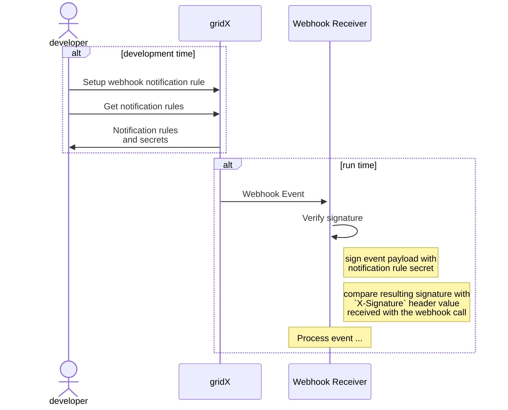
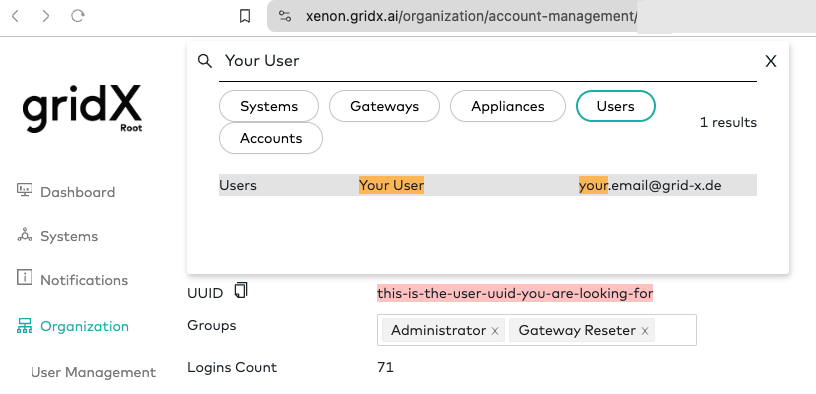

# :spider_web: :hook: Example gridX Webhook Receivers

`Webhook Receivers` are used to get notifications about state changes in gridX/XENON within your app.
A webhook receiver is a publicly accessible endpoint on a server that is called by gridX when domain events, e.g., when an appliance goes online, occur.
By implementing a webhook receiver, you can react on these events within your custom application. This allows for push based delivery of events as opposed to your app having to pull gridX's API constantly.

Currently, the following event types being emitted:

* `appliance/create`: Appliance was created
* `appliance/offline`: Appliance went offline
* `appliance/online`: Appliance went online
* `inverter/status`: Inverter status has changed
* `gateway/create`: Gateway was created
* `gateway/offline`: Gateway went offline
* `gateway/online`: Gateway went online
* `ev/plugged`: Vehicle was plugged into the charging station, charging state changed
* `commissioning/done`: Commissioning of a gateway was completed

If you want to learn more, [GitHub has a nice intro about webhooks](https://docs.github.com/en/webhooks/about-webhooks).

This repository contains sample webhook receiver implementations and instructions on how to generate receivers in a plethora of languages/frameworks to get you started.

## :toolbox: Prerequisites

* [for local development] [`zrok`](https://docs.zrok.io) to expose the locally running webhook receiver to the internet. Just follow the [getting started guide](https://docs.zrok.io/docs/getting-started/) to publicly share your locally hosted server.
* [for server scaffold generation] [`openapi-generator`](https://openapi-generator.tech/) can be used to generate server stubs for different languages.

## :bookmark_tabs: Usage

### :incoming_envelope: Receiving Events from gridX

To be able to receive events from gridX, you need to ...

1. ... run a webhook receiver from either of the samples below
2. ... expose the server to the internet using `zrok`
3. ... configure a webhook rule in XENON
4. ... remove the webhook rule after you're done with testing



#### 1. Run a sample webhook receiver

Pick one of the samples below to run and start the server according to the corresponding README.

The NodeJS server, e.g., can be started like this.

```sh
cd examples/node-express
yarn
yarn start
```

You can test whether any of the example receivers is running by just posting an empty JSON against `localhost:8080/gridx/events/appliance/online`. You'll likely get an error message (depending on the sample), but can see that a connection was made.

```sh
curl -X POST localhost:8080/gridx/events/appliance/online -d '{}'
```

#### 2. Expose the Server to the internet

All sample servers will start on port `:8080`. Run one of the examples below as described in the corresponding README and set up routing through zrok: `zrok share public http://localhost:8080`

This will set up a publicly accessible tunnel to the server running locally and show you the target URL required in the next step.

After setting up the `zrok` tunnel, you can use the [zrok web page](https://api.zrok.io/) to monitor incoming requests.

#### 3. Configure Webhook Rule

To be able to receive events, you first need to register a notification rule through the API for the events you wish to receive.

You need the following data to call the API:

* The account id for which you want to receive event notifications (from XENON account details page)
* The user id for which you want to receive event notifications (from your user details page on XENON). This is typically an administrative user for the resp. account
* Your API token (from your XENON user settings)
* The external webhook receiver URL. During development, this will be the external `zrok` URL.
* The event type you want to receive. See above for the complete list of supported events.

_register-appliance-online-webhook.json_

```json
{
    "eventType": "appliance/online",
    "notificationType": {
        "webhook": {
        "targetURL": "<webhook receiver URL>"
      }
    }
}
```

```sh
curl https://api.gridx.de/accounts/<your account id>/users/<your user id>/notifications/rules \
  --header 'authorization: Bearer <your API token>' \
  --header 'accept: application/vnd.gridx.v2+json' \
  --header 'content-type: application/json' \
  --data @register-appliance-online-webhook.json
```

To verify your rule was created, you can retrieve the current rules from the API.
Please note the `id` and `secret` properties of the rule you just created.

```sh
curl https://api.gridx.de/accounts/<your account id>/users/<your user id>/notifications/rules \
  --header 'authorization: Bearer <your API token>' \
  --header 'accept: application/vnd.gridx.v2+json' \
  --header 'content-type: application/json'
```

> [!NOTE]  
> 
> To get your user and account ID, you can call `https://api.gridx.de/user` with your API token. In the response, `id` is the user ID, `accountID` the account ID (d'uh). For details, please refer [to the API reference for `GET /user`](https://developer.gridx.ai/reference/get_user).
>
>```sh
>$ curl 'https://api.gridx.de/user' \
>    -H"authorization: Bearer $GRIDX_TOKEN" \
>    | jq '{"userID":.id, accountID}' ⮐
>...
>{
>  "userID": "...",
>  "accountID": "..."
>}
>```
>
> Alternatively, you can search for your user in XENON and look up the Account ID under `Settings -> Account Settings`:
> 
> 

#### 4. Clean up rules created for testing

After testing, please remember to remove the rule again to prevent continuous failures due to failed event deliveries.

```sh
curl -X DELETE \
  https://api.gridx.de/accounts/<your account id>/users/<your user id>/notifications/rules/<rule id> \
  --header 'authorization: Bearer <your API token>' \
  --header 'accept: application/vnd.gridx.v2+json' \
  --header 'content-type: application/json'
```

### :closed_lock_with_key: Security

As your webhook receiver needs to be exposed to the public internet for it to work, you need to make sure to process only requests sent by gridX. This is done by verifying the `X-Signature` (or `X-Signature-Rs256`) headers in incoming requests were signed using the notification rule's secret.
This secret is created when you set up the rule in the [third step above](#3-configure-webhook-rule). The secret will typically be kept in an environment variable (or some secret configuration storage) as not to hardcode it in the server implementation.

Additional details and code samples can be found [here](https://hookdeck.com/webhooks/guides/how-to-implement-sha256-webhook-signature-verification#go-example) and [here](https://docs.github.com/en/webhooks/using-webhooks/validating-webhook-deliveries#validating-webhook-deliveries).

An example for validating the `X-Signature` used by gridX can be found [here](./examples/go-secret-verification/README.md).

### :bento: Samples

* [NodeJS/Express](./examples/node-express/README.md): Hand-written webhook receiver that writes the IDs of appliances coming online to the console.
* [Go](./examples/go-server/README.md): Server with stubs for all supported event types generated using `openapi-generator`.[^1]
* [Python/aiohttp](./examples/python-aiohttp/README.md): Server with stubs for all supported event types generated using `openapi-generator`. For the sample, we print information about `appliance/online` events.[^2]
* [Go Signature Verification](./examples/go-secret-verification/README.md): Example implementation of signature validation in go.
* [Reactive Webapp](./examples/react-websockets/README.md): A webhook receiver that relays events to a React client app through websockets

### :factory: Generating Server Stubs

You might not want to hand-roll your own server implementation but get started more quickly by scaffolding a server
containing handler stub implementations for all supported events and go from there.

[`webhooks.yaml`](./webhooks.yaml) contains the [OpenAPI specification](https://spec.openapis.org/oas/v3.0.3) for webhook receivers.

From this specification, you can generate code using e.g. [`OpenAPI Generator`](https://openapi-generator.tech/) (supports a plethora of languages/frameworks)
or [`oapi-codegen`](https://github.com/deepmap/oapi-codegen) (go only)).
While you might need to [tweak the templates](https://openapi-generator.tech/docs/templating) used for generation and fine tune the results, it's a good way to get started in our experience.

To generate server stubs in a language of [your choice](https://openapi-generator.tech/docs/generators#server-generators) using `OpenAPI Generator`, use the following command.

```sh
  openapi-generator generate -g <server> -o examples/<servername> -i ./webhooks.yaml 
```

[^1]: We also ran `go mod tidy` and `goimports . -w` (find it [here](https://pkg.go.dev/golang.org/x/tools/cmd/goimports)) on the generated code to make it match the standard code style and remove unused imports put in by the generator.

[^2]: To be able to install all required libraries, you need [`python3`](https://www.python.org/downloads/) at at least `v3.11` and [`rust`](https://rustup.rs/) installed. Use the latest nightly build of rust: `rustup default nightly`. For the generated code to run, we needed to remove the `x_signature` parameter from the controller methods (`sed -i '' 's/, x_signature,/,/g' openapi_server/controllers/webhook_receiver_controller.py`). Its value can still be accessed through `request.headers` as shown in the example. Even given the whole process is cumbersome, you still might want use the generated code as a starting point and/or tweak the code generation templates to improve that. But that's out of the scope for these samples.
