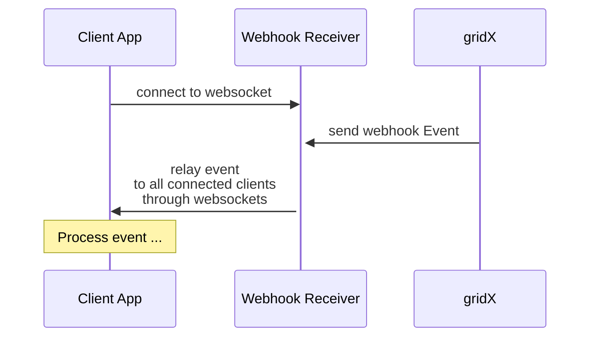
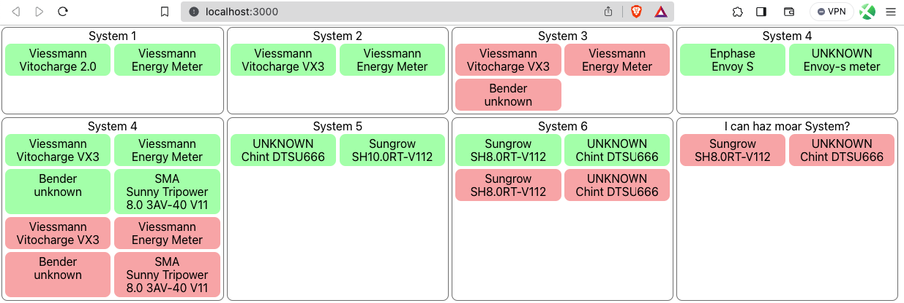

# Reactive Webapp

This example implements a simple Express based server to receive events from gridX through webhooks.
It forwards each events to a client app using websockets, to implement a fully reactive pattern instead of relying on polling.

This sample displays a dashboard of online and offline appliances grouped by system. In a real world implementation, you would not only rely on the events to build up the client's state. Instead, you would initially poll the status of the systems and appliances you're interested in initially and then update this state based on the events. This will make the data shown in your app more current while probably simplifying state updates and reduce the required traffic.

## Prerequisites

To run this sample, you need to have `NodeJS` and `yarn` as well as `ngrok` installed.

## Usage

1. Start the webhook receiver/websocket server: `$ cd server; yarn && yarn start`
2. Expose `:8080` through `ngrok` as described in the [project's README](../../README.md#2-expose-the-server-to-the-internet)
3. Set up notification rules for `applicance/online` and `appliance/offline` events as described in the [project's README](../../README.md#3-configure-webhook-rule)
4. Start the client app: `$ cd client; yarn && yarn start`
5. Open http://localhost:3000, lean back and watch the appliance states roll in